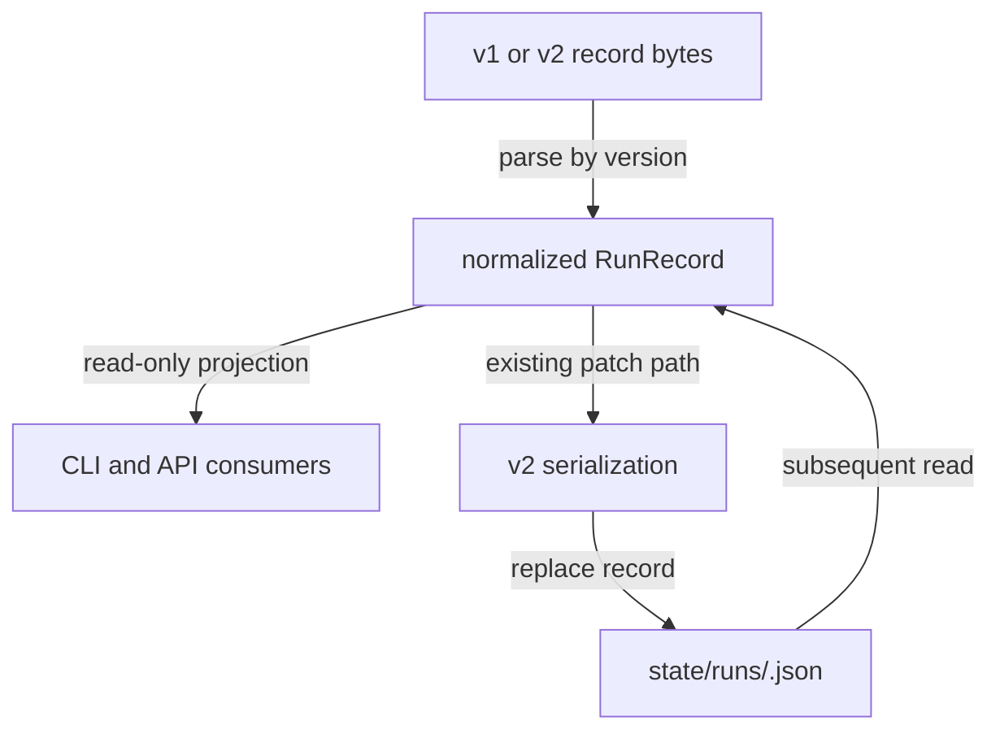

# Run Record v2 Lazy Migration

## At a Glance

Add a versioned run-record reader and lazy v1-to-v2 migration while preserving
public compatibility, conservative readiness projection, and crash-safe storage.
The change stays inside this repository and keeps existing record paths and CLI
selectors stable.

## Context

Run records under the configured state directory are durable process and
readiness projections. Existing installations may contain v1 records while new
runs need v2 decision and reason-code fields. Reads, selectors, status, pruning,
and finalization must continue to operate on a mixed store.

## Verified Facts

- `src/core/run-store.ts` owns record parsing, listing, updates, and pruning.
- `src/core/convergence.ts` owns readiness decisions and stable reason codes.
- `src/cli/status.ts` and `src/cli/runs.ts` project stored records without owning
  readiness truth.
- New writes already have one store boundary through which atomic replacement
  can remain centralized.

## Target State

- New records declare schema version 2 and store the additive terminal decision
  and reason-code projection.
- Readable v1 records remain addressable but project
  `unable-to-decide:legacy-state-requires-review` until fresh exact-plan review.
- Unknown future versions and malformed files are skipped without rewriting
  their bytes.
- A v1 record is upgraded only when an existing write path next changes it.
- Record replacement remains atomic and a process interruption never exposes
  partial JSON to concurrent readers.

## Scope

In scope:

- Version-specific parsing and normalization in `src/core/run-store.ts`.
- Additive exported terminal-readiness types and existing compatibility fields.
- Lazy v2 emission through the existing record writer.
- Mixed-store CLI and API projections.
- Atomic replacement, interruption, retry, and concurrent-reader tests.

Out of scope:

- An eager migration command or bulk rewrite.
- Changing run IDs, record locations, selectors, retention policy, or exit codes.
- Promoting legacy `clean` or `satisfied` fields to trusted readiness.
- Cross-repository delivery or a new storage backend.

## Work Plan

| Phase | Work                                                   | Gate                                                             |
| ----- | ------------------------------------------------------ | ---------------------------------------------------------------- |
| P1    | Add versioned parsing and conservative normalization.  | Mixed v1/v2 fixtures parse without legacy promotion.             |
| P2    | Upgrade records lazily through the existing writer.    | A v1 update emits schema-valid v2 and preserves identity fields. |
| P3    | Project compatibility surfaces and add fault coverage. | Static checks and all tests pass.                                |

### P1 - Versioned read contract

1. Extend the internal run-record model with `schemaVersion`, terminal decision,
   and reason-code fields while retaining existing optional compatibility fields.
2. Parse persisted JSON as unknown and dispatch to explicit v1 and v2 validators.
3. Normalize v1 terminal state to `unable-to-decide` with the stable legacy review
   reason. Do not infer readiness from `finalStatus`, `satisfied`, or artifact
   presence.
4. Skip malformed and unsupported future versions, retaining diagnostics without
   changing source bytes.

### P2 - Lazy migration writer

1. Keep create and patch operations behind the current run-store writer.
2. When a valid v1 record is patched, serialize the normalized v2 record directly
   to its final `state/runs/<id>.json` path with `writeFileSync`; a retry can parse
   whatever bytes remain if the process stops during the write.
3. Preserve run ID, timestamps, process identity, work and log paths, ordering,
   and compatibility fields during the upgrade.
4. Leave records untouched on pure list, select, status, show, log, and prune
   reads.

### P3 - Compatibility and fault verification

1. Keep `listRuns`, `getRun`, selectors, status, show, logs, and pruning compatible
   with mixed v1/v2 stores.
2. Add golden fixtures for active and terminal v1, valid v2, malformed JSON,
   missing legacy fields, and unsupported future versions.
3. Add interruption and concurrent-reader coverage around lazy migration, plus
   retry assertions that preserve one logical update.
4. Run `pnpm run check` and `pnpm run test`.

## Files and Interfaces

- `src/core/run-store.ts`: versioned parser, conservative normalization, and lazy
  migration writer.
- `src/types.ts`: additive terminal-readiness record fields.
- `src/index.ts`: additive type exports through the existing package root.
- `src/cli/status.ts`, `src/cli/runs.ts`, and `src/cli/picker.ts`: compatibility
  projections only.
- `tests/unit/run-store.test.ts` and `tests/integration/runs.test.ts`: mixed-store,
  atomicity, interruption, and public-surface coverage.

No existing CLI flag, package export, exit code, record path, or selector grammar
is removed or renamed.

## Verification

- Unit tests prove conservative v1 projection and exact v2 round trips.
- Byte snapshots prove malformed and future-version files are not rewritten.
- Fault injection interrupts migration before replacement and confirms readers
  observe either complete v1 or complete v2.
- Concurrent listing and pruning ignore temporary migration files.
- Package import tests compile existing `RunRecord` object literals.
- `pnpm run check` and `pnpm run test` pass.

## STOP Triggers

- Stop if compatibility requires deriving trusted readiness from legacy fields.
- Stop if the upgrade cannot preserve run identity and selector ordering.
- Stop if a reader must mutate records or unknown versions.
- Stop if crash safety cannot guarantee complete JSON before replacement.
- Stop if the change requires a bulk migration or a new storage backend.

## Impact Graph

