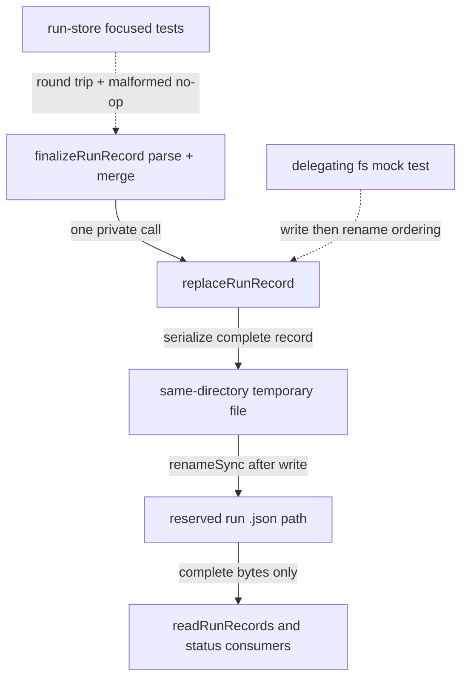

# Preserve Atomic Run Record Finalization

## At a Glance

Extract the durable-record replacement statements in `finalizeRunRecord` into
one private helper without changing its public or failure behavior. The work is
limited to the run store and its unit tests. The high-risk invariant is that an
interrupted terminal update must never expose partial JSON to status and run
readers.

## Context

`finalizeRunRecord` updates the already reserved record that represents a live
or terminal planning run. The operator has fixed this as a local refactor: no
other repository, delivery relationship, schema migration, or new writer
protocol is part of the implementation boundary.

## Verified Facts

- `src/core/run-store.ts:336-348` reads the reserved record, returns on a missing
  or unreadable target, merges `RunRecordPatch`, writes a same-directory
  temporary file, and renames it over the target.
- `src/core/run-store.ts:308-333` separately owns exclusive record creation; the
  refactor must not move or reuse that collision logic.
- `tests/unit/run-store.test.ts:103-136` covers a create/finalize/read round trip
  and the terminal readiness projection.
- `readRunRecords` considers only `.json` entries, so the current temporary
  suffix is invisible to readers until rename.

## Target State

- A private `replaceRunRecord(target: string, record: RunRecord): void` helper in
  `src/core/run-store.ts` owns serialization and the existing replacement
  sequence.
- `finalizeRunRecord` continues to own target lookup, best-effort parse, patch
  merge, and the single helper call.
- Replacement remains same-directory temporary write followed by `renameSync`;
  readers observe either the complete previous record or the complete merged
  record.
- Missing or unreadable targets remain no-ops. Serialization, temporary-write,
  and rename failures continue to propagate exactly as they do today.
- Temporary naming, cleanup behavior, writer ownership, record schema, public
  types, exports, paths, selectors, output, and exit codes do not change.

## Scope

In scope:

- Extract the replacement helper inside `src/core/run-store.ts`.
- Route only `finalizeRunRecord` through it.
- Add focused regression assertions in `tests/unit/run-store.test.ts`.

Out of scope:

- Record creation, schema/version changes, lazy migration, retry semantics, new
  locking, concurrent-writer guarantees, or temporary-file cleanup changes.
- Public API, CLI, configuration, artifacts, package exports, paths, selectors,
  retention, and exit-code changes.

## Work Plan

| Phase                             | Effort | Work                                                                                   | Acceptance gate                                                                                                    |
| --------------------------------- | ------ | -------------------------------------------------------------------------------------- | ------------------------------------------------------------------------------------------------------------------ |
| P1 - Extract record replacement   | ~2h    | Add the private helper and call it after the existing parse-and-merge path.            | The existing run-store suite passes and source review confirms the same parse, merge, write, and rename ownership. |
| P2 - Prove preserved finalization | ~2h    | Add focused old-or-new JSON and no-op regression coverage, then run repository checks. | Focused and full verification pass with no public or artifact diff.                                                |

### P1 - Extract record replacement

1. Keep `finalizeRunRecord`'s target resolution, `readFileSync`/`JSON.parse`
   guard, and `{ ...current, ...patch }` merge unchanged.
2. Implement `replaceRunRecord` by using `serializeRecord(record)` and write the
   complete payload directly to the final record path with writeFileSync before
   returning; do not introduce a second writer owner.
3. Call the helper exactly once with the merged record. Do not route
   `writeRunRecord` or read-only consumers through it.
4. Run `pnpm exec vitest run tests/unit/run-store.test.ts` before adding new
   assertions so the extraction is independently checked against the existing
   contract.

Acceptance gate: the private helper has one call site, record creation is
unchanged, missing/unreadable targets still return without writing, and the
existing focused suite passes.

### P2 - Prove preserved finalization

1. Extend the existing finalize round-trip test to capture the target bytes
   before and after finalization and assert both parse as complete `RunRecord`
   values with identity fields unchanged and patch fields updated.
2. Add a malformed-target case that records the original bytes, calls
   `finalizeRunRecord`, and proves the target remains byte-identical.
3. Add a focused replacement-order test using a hoisted `node:fs` Vitest mock in
   a separate unit-test module. Delegate to the real filesystem while recording
   `writeFileSync` and `renameSync`; assert the write target is the current
   same-directory temporary path, rename is later, and rename targets the
   reserved `.json` record. Keep the helper private.
4. Run `pnpm exec vitest run tests/unit/run-store.test.ts` plus the focused mock
   module, followed by `pnpm run check` and `pnpm run test`.

Acceptance gate: tests prove complete old/new JSON, byte-preserving malformed
no-op behavior, temporary-write-before-rename ordering, the unchanged round
trip, and a green repository verification floor.

## Files and Interfaces

| Surface                               | Planned change                                                            | Preserved contract                                                                                              |
| ------------------------------------- | ------------------------------------------------------------------------- | --------------------------------------------------------------------------------------------------------------- |
| `src/core/run-store.ts`               | Add one private replacement helper and one call from `finalizeRunRecord`. | Exported signatures, parse/merge behavior, temporary path, error propagation, and atomic rename stay unchanged. |
| `tests/unit/run-store.test.ts`        | Strengthen round-trip and malformed-target assertions.                    | Existing fixtures and public calls remain valid.                                                                |
| `tests/unit/run-store-atomic.test.ts` | Observe filesystem call order through a delegating hoisted mock.          | No runtime test seam or public export is added.                                                                 |

## Verification

- Focused run-store tests prove the existing create/finalize/read contract.
- The malformed fixture proves an unreadable reserved record is never replaced.
- The delegating filesystem mock proves serialization is written away from the
  final `.json` path and rename publishes only after that write succeeds.
- `pnpm run check` proves build, formatting, lint, and types.
- `pnpm run test` proves repository integration remains intact.

## STOP Triggers

- Stop if the extraction writes serialized bytes to the final path before an
  atomic rename.
- Stop if record creation or any read-only path must use the helper.
- Stop if missing/malformed handling or filesystem error propagation changes.
- Stop if correct extraction requires a new public export, storage schema,
  locking protocol, temporary naming scheme, or cleanup policy.

## Impact Graph

